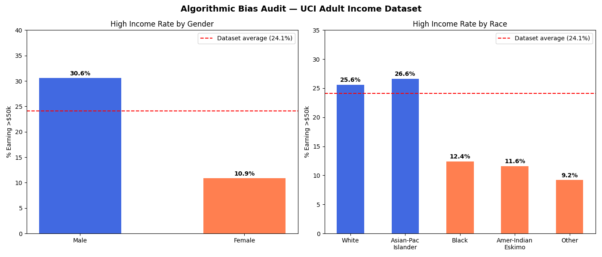

# Algorithmic Bias Audit 🔍

## Overview
A full bias audit pipeline applied to the UCI Adult Income dataset. It's identifying gender and race-based disparities in raw data and then proving those disparities 
by amplifying by a machine learning model.

Built in the context of **EU AI Act (2024)** compliance,  which mandates bias auditing for high-risk AI systems used in financial services.

## Key Findings

### Raw Data Disparities
- **Gender gap**: Men earn >$50k at 30.6% vs women at 10.9% — a **3x disparity.**

- **Race gap**: White and Asian-Pacific Islander earners significantly outperform.

  Black, Native American and Other groups, up to a **2.8x disparity.**

### Model Bias
After training a Logistic Regression classifier on this data:

- **Male False Negative Rate: 56.4%**
- **Female False Negative Rate: 92.3%**

When a woman actually earns over $50k, the model gets it wrong **92.3% of the time**, predicting she earns less than she does.

If a bank used this model for loan approvals, a high-earning woman would be systematically denied or underserved; not because of her finances but 
because of her demographics.

## Why This Matters
Under the EU AI Act, any high-risk AI system used in banking, credit scoring or employment must be audited for bias before deployment. Companies that fail to comply face fines of up to €30 million.

This project demonstrates a complete audit pipeline; from identifying disparities in raw training data to proving a trained model replicates and amplifies those disparities.

## Tech Stack
- Python 3.9
- Pandas
- Matplotlib
- Scikit-learn